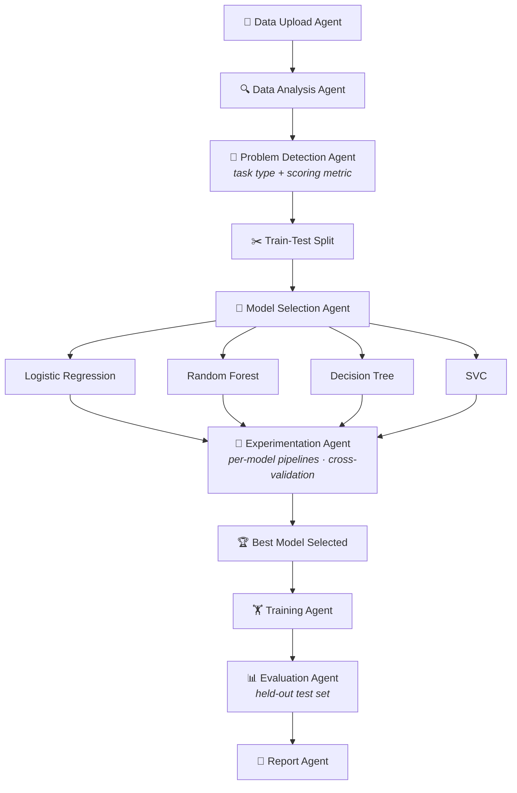

<div align="center">

# 🧭 MLPilot

### *Hand it a dataset. Get back a trained, evaluated, documented model.*

An autonomous AI/ML engineer built as a stateful multi-agent graph on **LangGraph**.


[Overview](#-overview) · [Pipeline](#-the-pipeline) · [Features](#-capabilities) · [Quick Start](#-quick-start) · [Roadmap](#-roadmap)

</div>

---

## ✨ Overview

Most ML projects begin the same way: load the data, poke around, clean it, try a few models, compare, report. **MLPilot automates that entire loop.**

Each stage is owned by a dedicated agent. The agents communicate through a single shared LangGraph state, so every decision (task type, metric, preprocessing, model scores) is visible, traceable and reusable by the next stage.

> **North star:** an autonomous AI/ML engineer that inspects a dataset, chooses the right strategy, runs fair experiments, and justifies the winning model with minimal human input.

---

## 🗺 The Pipeline



<details>
<summary><b>Plain-text version</b></summary>

```text
Upload → Analysis → Problem Detection (task type + metric)
   → Train-Test Split
   → Model Selection
   → Per-model Pipelines (impute → encode → scale → model)
   → Cross-Validation Comparison
   → Best Model → Final Training
   → Evaluation (held-out test set)
   → Report
```

</details>

### Design principles

| Principle | What it means in MLPilot |
|---|---|
| 🔒 **Leakage-safe by design** | The split happens *first*. Imputation, encoding and scaling are fit on training data only, and refit inside every CV fold. |
| 🧩 **One pipeline per model** | Preprocessing and estimator travel together in a scikit-learn `Pipeline`. Scale-sensitive models (SVC, Logistic Regression) get scaling; tree models skip it. |
| 🎯 **Metric-aware** | The scoring metric is chosen from the data (e.g. F1 / ROC-AUC for imbalanced targets, not blind accuracy). |
| 🧾 **Shared, inspectable state** | Every agent reads from and writes to one LangGraph state object. Nothing is hidden. |
| 🧪 **Evidence over opinion** | Models are ranked by cross-validated performance, then confirmed once on an untouched test set. |

---

## 🚀 Capabilities

<table>
<tr>
<td width="50%" valign="top">

### 📂 Ingestion
- Loads datasets from CSV
- Validates and rejects empty or unreadable files
- Stores data and dimensions in shared state

### 🔍 Analysis
- Separates numerical and categorical features
- Flags columns with missing values
- Summarizes dataset shape and structure

### 🧠 Problem Detection
- Infers **classification vs regression** from the target column
- Selects an appropriate scoring metric
- Passes task context to every downstream agent

### ✂️ Splitting
- Train-test split before any fitting
- Stratified splits for classification
- Keeps the test set sealed until final evaluation

</td>
<td width="50%" valign="top">

### ⚙️ Data Preparation
- Imputes missing numerical and categorical values
- Encodes categorical features
- Scales numerical features
- Packaged as reusable, per-model pipelines

### 🎯 Model Selection & Experimentation
- Picks diverse candidates: linear, ensemble, tree-based, kernel
- Cross-validates every candidate on the same folds
- Ranks models on the chosen metric

### 📊 Evaluation
- Final model scored on unseen test data
- Task-appropriate metrics

### 📑 Reporting
- Dataset profile and detected problem type
- Candidate models and CV results
- Final test performance and the winning model

</td>
</tr>
</table>

### Model lineup

| Family | Classification | Needs scaling |
|---|---|:---:|
| Linear | Logistic Regression | ✅ |
| Ensemble | Random Forest | ➖ |
| Tree | Decision Tree | ➖ |
| Kernel | Support Vector Classifier (SVC) | ✅ |

> Regression counterparts (Linear Regression, Random Forest Regressor, SVR, etc.) are part of the problem-detection design and covered in the [roadmap](#-roadmap).

---

## ⚡ Quick Start

```bash
# 1. Clone
git clone <your-repo-url>
cd mlpilot

# 2. Create an environment
python -m venv .venv
source .venv/bin/activate        # Windows: .venv\Scripts\activate

# 3. Install dependencies
pip install -r requirements.txt

# 4. Run on your dataset
python main.py --data path/to/your_dataset.csv --target your_target_column
```

> Adjust the entry point and flags to match your project layout.

---

## 📑 What the Report Contains

```text
┌─ MLPilot Report ───────────────────────────────┐
│  Dataset        rows × columns, feature types  │
│  Problem        classification / regression    │
│  Metric         chosen scoring metric          │
│  Candidates     models evaluated               │
│  CV Results     mean ± std per model           │
│  Winner         best cross-validated model     │
│  Test Score     final held-out performance     │
└────────────────────────────────────────────────┘
```

---

## 🛣 Roadmap

- [x] CSV ingestion and validation
- [x] Automated dataset analysis
- [x] Problem-type detection
- [x] Leakage-safe preprocessing pipelines
- [x] Multi-model cross-validation
- [x] Final evaluation and report generation
- [ ] Regression model branch
- [ ] Hyperparameter tuning (GridSearchCV / Optuna) for top candidates
- [ ] Class-imbalance handling inside CV (class weights, SMOTE)
- [ ] Feedback loop: retry preprocessing or model selection on weak results
- [ ] Gradient boosting models (XGBoost / LightGBM)
- [ ] Exportable trained model and preprocessing artifacts

---

## 🤝 Contributing

Ideas, issues and pull requests are welcome. If you plan a larger change, such as a new agent or a new model family, please open an issue first so the graph design stays coherent.

---

<div align="center">

**MLPilot** · from raw data to reasoned model, on autopilot.

</div>
